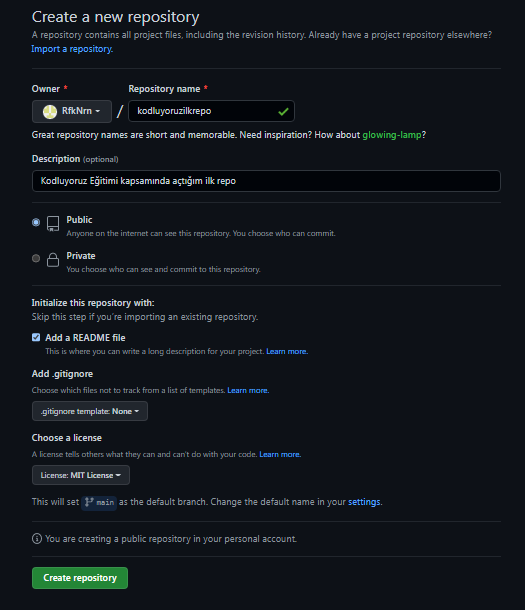

# Kodluyoruz Ilk Repo
Bu repo [Kodluyoruz](https://www.kodluyoruz.org/) Git eğitiminde oluşturduğum ilk repo. İçerisinde bir adet README dosyası, bir adet de index.html barındırıyor.


## Installation
Öncelikle projeyi clonelayın. (Buraya sizin reponuzdan aldığınız link gelecek)
```sh
git clone https://github.com/RfkNrn/kodluyoruzilkrepo.git
```

## Usage
Projeyi cloneladıktan sonra Visual Studio Code programında açınız.

Linux için:
```sh
cd kodluyoruzilkrepo
code .
```

## Contributing
Pull requestler kabul edilir. Büyük değişiklikler için, lütfen önce neyi değiştirmek istediğinizi tartışmak için bir konu açınız.

## Licence
[MIT](https://choosealicense.com/licenses/mit/)
